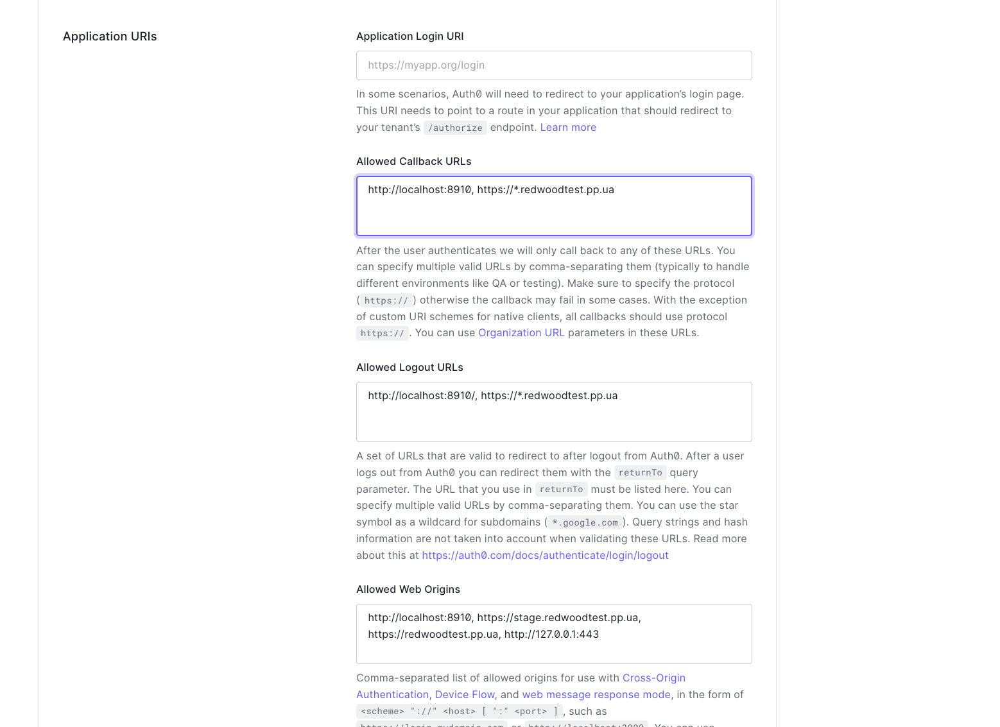
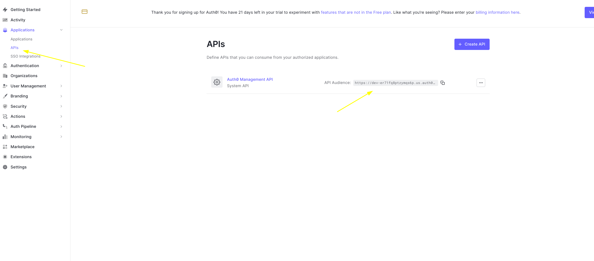

DOMAIN_NAME in .env file will contain subdomain name that is set
in corresponding github deploy workflow.
For production build don't set variable 'subdomain-name'

## Auth0 setup:
Add list of allowed origins

AUTH0_AUDIENCE .env variable:

